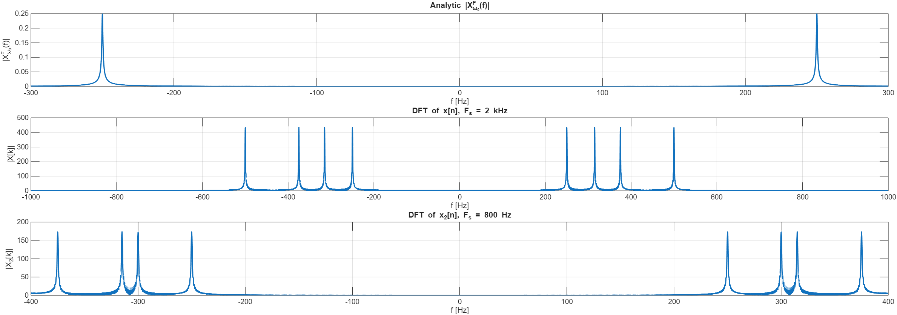

# Signal Processing – Sampling & Reconstruction (MATLAB)

This project demonstrates key concepts in Digital Signal Processing (DSP) using MATLAB.  
It includes Fourier analysis, sampling theory, downsampling, upsampling, and reconstruction using **ideal (sinc), ZOH**, and **FOH** filters.  
The project also includes full visualizations and audio signal synthesis.

---

##  **Project Structure**
###  Fourier Transform of a Decaying Sinusoid  
- Analytical continuous-time transform  
- Magnitude spectrum visualization  

###  Construction of a Piecewise Signal  
Four 1-second segments, each with different frequencies:
- 250 Hz  
- 315 Hz  
- 375 Hz  
- 500 Hz  

###  Sampling & Aliasing  
The signal is sampled at:
- **16 kHz**
- **2 kHz**
- **800 Hz**

Visualizations include:
- Time-domain samples  
- Frequency-domain DFT plots  
- Aliasing effects  

###  Downsampling & Upsampling  
Using MATLAB built-ins:
- `downsample()`
- `upsample()`

###  Reconstruction Methods  
Three reconstruction filters implemented manually:

####  Ideal (sinc) interpolation  
Accurate reconstruction of a bandlimited signal.

####  ZOH (Zero-Order Hold)  
Piecewise-constant reconstruction.

####  FOH (First-Order Hold)  
Linear interpolation (triangular kernel).

Comparison is shown around **t = 3 sec**.

---

##  Example Visualizations (Insert Your Plots Here)

```markdown


